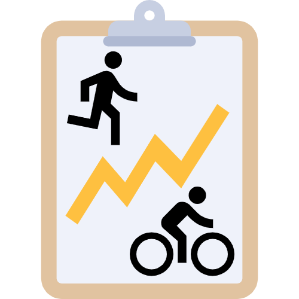
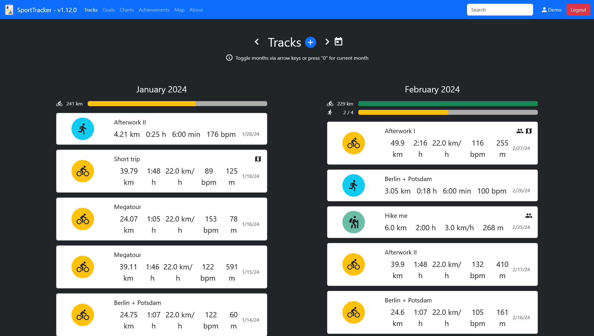
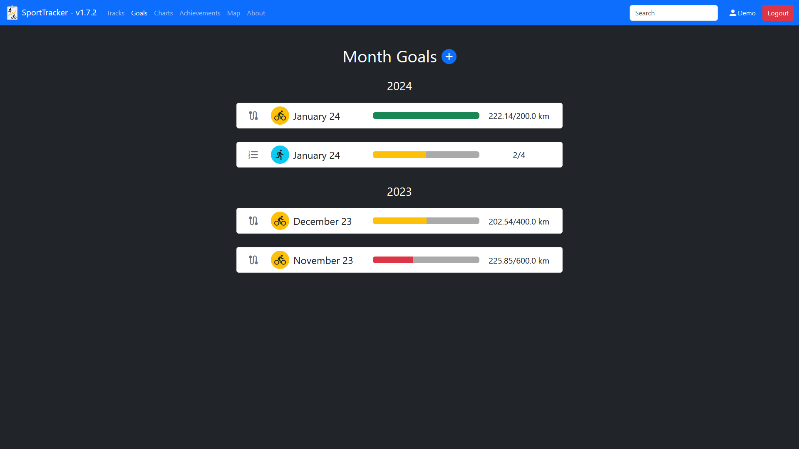
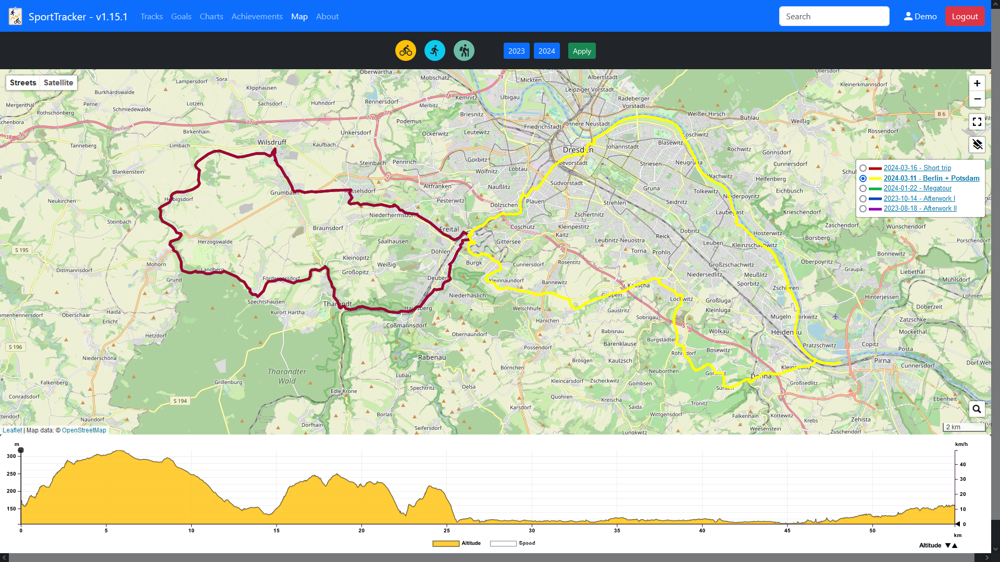
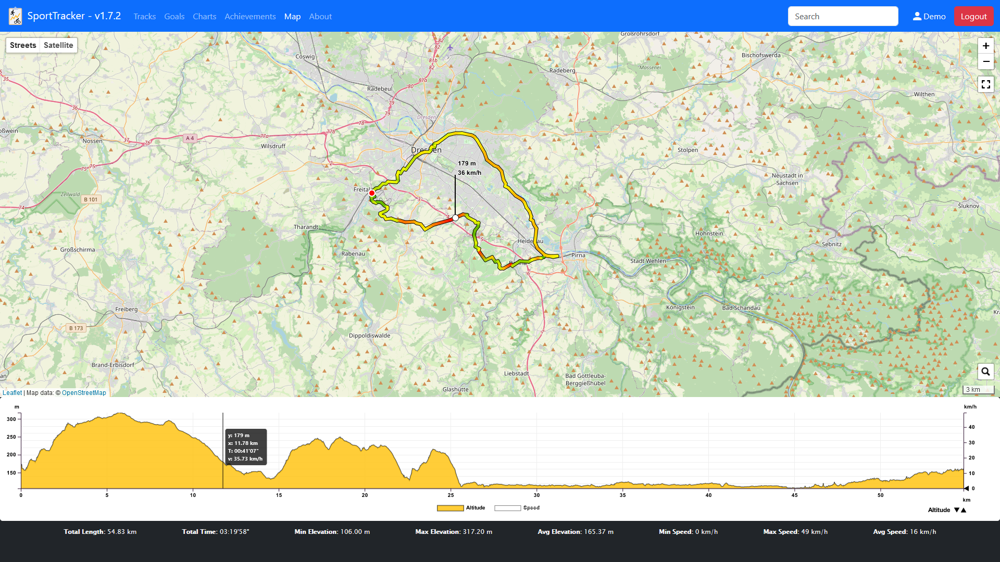
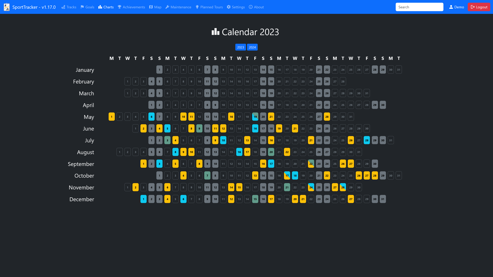
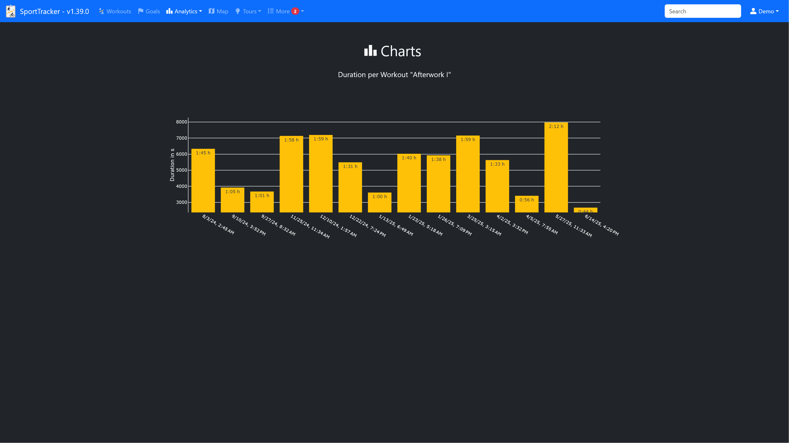
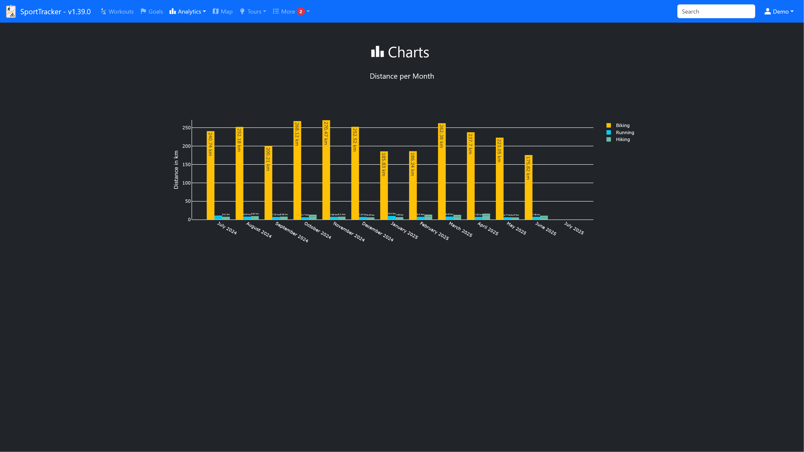
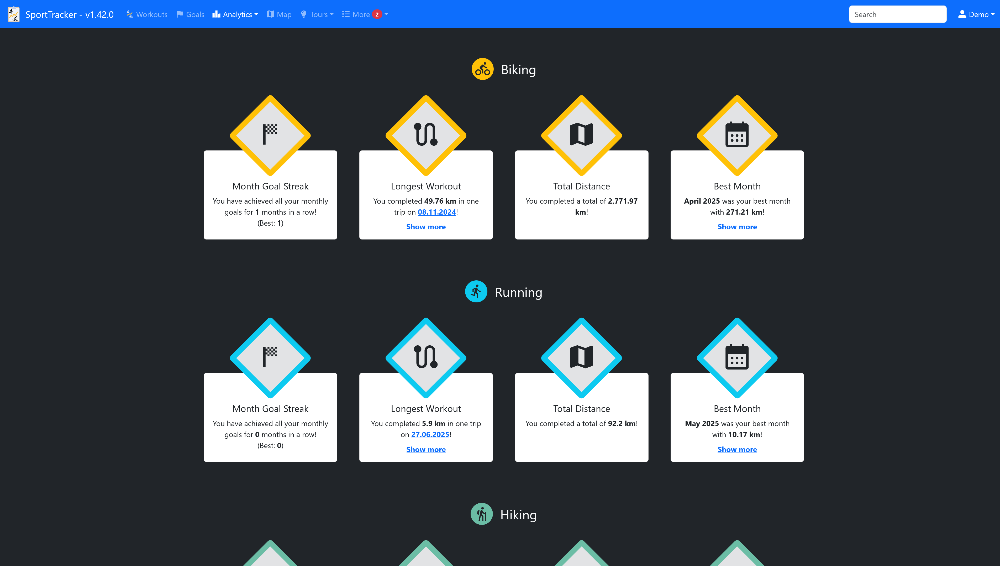
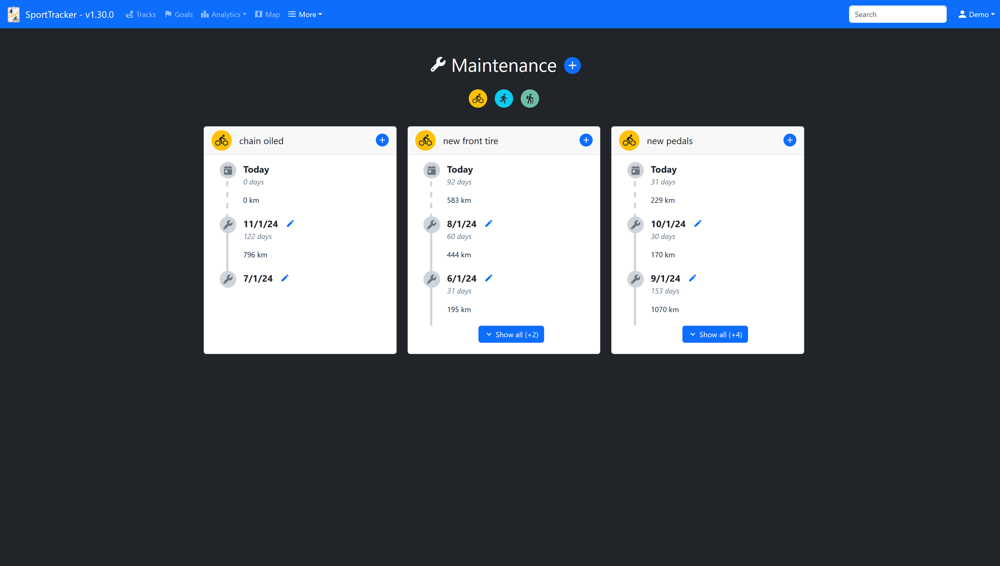

# SportTracker

Self-hosted sport data tracking server.

## Key Features

### Multi-user support
Multiple users can track their sport data using different accounts.

### Record your sport data
Record the data of your training sessions after you have finished them.

Supported types of sports:
- Biking
- Running
- Hiking

You can fill in a lot of information for each training session. If the pre-defined inputs are not enough, it is possible to set custom fields for each type of sports.

### Month goals
Set custom month goals (either distance or number of tracks).
The current status of each month goal is visualized via progress bars.

### GPX tracks / Map
A GPX recoding can be attached to every single track. The GPX recordings can be viewed on a map.

View all gpx tracks on a map:

View a single gpx track on a map, with additional information (e.g. track line is colored according to speed):

### Charts
Tracked data is visualized in charts, e.g.:
- Distance per month
- Average speed
- Duration per Track
- etc.

### Achievements
The achievement page shows aggregated information about all your tracks.

### Maintenance Events
Record your maintenance events for each sport type.

### Available languages
- German
- English

## Run SportTracker
1. Install dependencies via `poetry install --no-root --without dev`
2. Copy `settings-example.json` to `settings.json` and adjust to your configuration
3. Run the server: `<path_to_python_executable_in_poetry_venv> src/SportTracker.py` 

💡 Or use the docker image.

## Command line arguments
- `--debug`, `-d` = Enable debug mode
- `--dummy`, `-dummy` = Generate dummy tracks and demo user

## Database migration
Updating to the latest SportTracker release may require database migration.   
This is only necessary if you already have a running SportTracker instance and a database filled with entries.  
Whether a database migration is necessary will be stated in the release notes.  
The migration will be performed automatically upon start of SportTracker.

## This project uses 3rd-party components

### Python dependencies
Python dependencies can be found in `pyproject.toml` and corresponding `poetry.lock`.

### Javascript / CSS dependencies
- Bootstrap https://getbootstrap.com/
- Leaflet https://leafletjs.com/
- Mousetrap https://craig.is/killing/mice
- plotly.js https://github.com/plotly/plotly.js
- jQuery https://jquery.com/

### Additional dependencies
- Google Material Icons https://fonts.googleapis.com/icon?family=Material+Icons
- Font Awesome Icons https://fontawesome.com/

### Icons / Images
- bike icon by Google Material Icons https://fonts.google.com/icons?selected=Material%20Icons%3Adirections_bike%3A
- runner icon by Google Material Icons https://fonts.google.com/icons?selected=Material%20Icons%3Adirections_run%3A
- checklist icon by Freepik - Flaticon https://www.flaticon.com/de/kostenlose-icons/hakchen