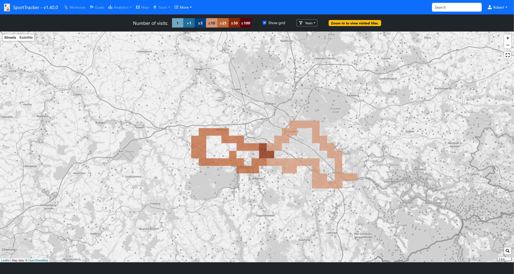
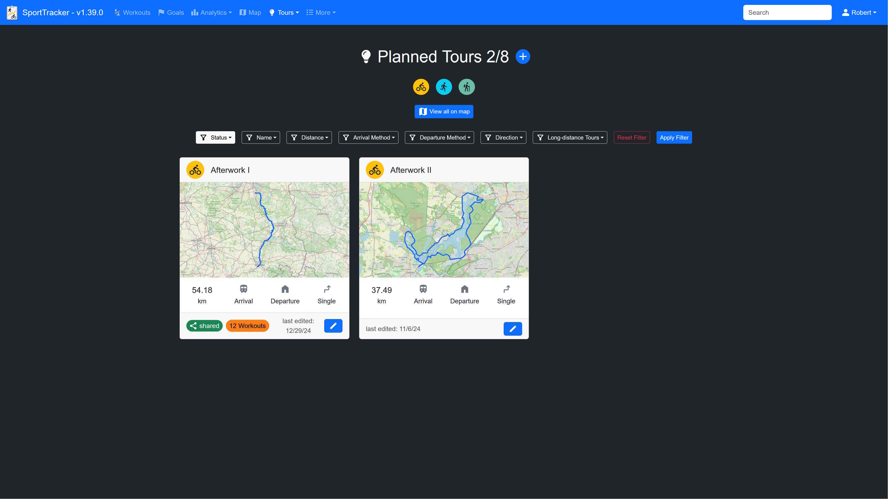

# SportTracker

Self-hosted workout data tracking server.


## Key Features

### Multi-user support
Multiple users can track their workout data using different accounts.

### Record your workout data
Record the data of your workout sessions after you have finished them.

Supported workout types:

Distance-based:
- Biking
- Running
- Hiking

Duration-based:
- Fitness Workouts

You can fill in a lot of information for each workout session. If the pre-defined inputs are not enough, it is possible to set custom fields for each type of workout.

You can share your workouts via public links.


### Month goals
Set custom month goals (either distance, duration or number of workouts).
The current status of each month goal is visualized via progress bars.


### GPX tracks / Map
A GPX recoding can be attached to every distance-based workout. The GPX recordings can be viewed on a map.

View all gpx tracks on a map:


View a single gpx track on a map, with additional information (e.g. track line is colored according to speed):


### FIT tracks
SportTracker also supports .fit files in addition to gpx. Those files will be stored in the `data` folder as well.  
During upload of a .fit file for a workout or planned tour, a gpx file is automatically generated from the .fit file.

__NOTE__: The converted gpx file will only contain basic data like latitude, longitude, timestamps and altitude information. 

#### Use FIT file to prefill workout form
SportTracker also allows to use .fit files to automatically prefill the workout form with data from the .fit file (e.g. duration, distance, etc.)

### Tile Hunting
Each user can optionally enable tile hunting.   
If enabled an additional map is provided that shows all already visited tiles. A tile is considered visited if one or more gpx tracks cross it. By default, the size of a tile is equivalent to the size of an OpenStreetMap tile at zoom level 14 (This can be configured in the SportTracker settings file).
Tile hunting can be useful to discover new areas in your surrounding or gain some motivation to explore new routes.
The tile hunting map will also show the maximum square area that is completely covered by your visited tiles.

Overall tile hunting map:


Map for a single workout:


#### Tile hunting overlay access
To plan your next tile hunting route you may want to allow access to your tile hunting map via a share code in your user settings.  
This can be useful to add a custom overlay to OpenStreetMap based maps, e.g. https://bikerouter.de.

1. Add a custom overlay layer
2. Use the url shown on your user settings page (e.g. http://localhost/map/tileOverlay/1df60cca70c340239cfd869673443be4/{z}/{x}/{y}.png)

__NOTE__: In your user settings, you can choose whether tiles that are visited by your already planned tours should be displayed (in grey) in the overlay.

### Tile Hunting heatmap
In addition to the normal tile hunting map a heatmap is available.  
Each tile will be colored according to the number of workouts that visited each tile.  
You can click on the map to get the exact number of visits per tile.

Tile hunting heatmap:


### Charts
Tracked data is visualized in charts, e.g.:
- Distance per month
- Average speed
- Duration per workout
- etc.

Example charts:


### Annual Statistics
Every year is summarized for each workout type.


### Achievements
The achievement page shows aggregated information about all your workouts.


### Maintenance Events
Record your maintenance events for each workout type.  
You can optionally set reminders for each maintenance.  
SportTracker can be configured to send notifications via a ntfy server once a maintenance reminder is triggered.


### Planned Tours
Save your planned tours for each workout type (distance-based types) and view them on a map. Once you actually took a planned tour you can link the corresponding workout to the tour.



Share planned tours with other SportTracker users or create public links.


### Long-distance Tours (tours with multiple stages)
Add multiple planned tours as stages to a long-distance tour.  
See your progress on how many stages you already completed and prepare your workouts with an overview map.


#### Enable GPX preview Images

SporTracker can show a preview image for each planned tour and long-distance tour. The images are not generated by SportTracker.  
An external service can be used instead.

In order to activate gpx preview images, follow these steps:

**1. Set up a georender instance https://github.com/deadlocker8/georender (forked from https://github.com/loskoderos/georender)**
- a) Build docker image: `docker build -t georender .`
- b) Run docker image with specific settings: `docker run -p 3000:3000 georender -w 800 -h 450 -t osm`
- Or if using docker compose see `docker-compose-with-georender.yaml` and adjust according to the documentation in the section `How to run SportTracker via docker compose` .

**2. Enable gpx preview images in your SporTracker settings.json
Update the section `gpxPreviewImages` in your settings.json to contain the following values**
```json
"gpxPreviewImages": {
    "enabled": true,
    "geoRenderUrl": "http://localhost:3000"
}
```
Where http://localhost:3000 is the address and port number of your georender instance started in step 1.


### Notifications
SportTracker creates several notifications on certain events:

- a maintenance reminder limit is exceeded
- planned tours:
  - a planned tour is shared with you
  - a shared planned tour has been updated
  - your access to a shared planned tour has been revoked
  - a shared planned has been deleted
- long-distance tours:
  - a long-distance tour is shared with you
  - a shared long-distance tour has been updated
  - your access to a shared long-distance tour has been revoked
  - a shared long-distance has been deleted
- the distance of a workout is longer than any other distance workout with the same type that was performed before
- the duration of a fitness workout is longer than any other fitness workout that was performed before
- a month goal is reached
- the total distance of a month is greater than any previous month
- the total duration of a month is greater than any previous month

All those notifications will be shown in the notification center (reachable via the notification counter in the navbar).
SportTracker can also be configured to send these notifications via a notification provider.

Supported notification providers:
- `ntfy` (More information about ntfy and how to set up your own ntfy server: https://github.com/binwiederhier/ntfy)


For each notification provider you can choose, which notifications should be sent:


### Available languages
- German
- English


## API
SportTracker offers a basic REST-API for the most common use-cases.  
The corresponding swagger-ui is available at `/api/v2/docs`


## How to run SportTracker locally
1. Install dependencies via `poetry install --no-root --without dev`
2. Run `npm install` and `npm run build` inside the `js` folder.
3. Copy `settings-example.json` to `settings.json` and adjust to your configuration
4. Run the server: `<path_to_python_executable_in_poetry_venv> src/SportTracker.py` 

## Command line arguments
- `--debug`, `-d` = Enable debug mode
- `--dummy`, `-dummy` = Generate dummy workouts and demo user

## How to run SportTracker via docker compose
An example docker compose file is provided (`docker-compose.yaml`).

You have to make the following changes before starting via docker compose:
1. In the `docker-compose.yaml` change `<POSTGRES_DB_NAME>`, `<POSTGRES_USER>` and `<POSTGRES_PASSWORD>`.
2. The `docker-compose.yaml` uses volume mounts to persist your data even if the containers are stopped and removed.
  - Therefore, you have to change `<PATH_ON_HOST>` to an absolute path to a folder on your host machine.
3. Copy `settings-example.json` to `<PATH_ON_HOST>/settings.json` and adjust to your configuration. 
  - It is important to change the value of `secret`. 
  - Adjust the database URI and set `sporttracker-user`, `sporttracker-password` and `sporttracker-db-name` to match the values in the `docker-compose.yaml` from step 1.
4. Build and run all containers using `docker compose up --build`.
5. Observe the console output for the admin password that is generated only once during the initialization of the SportTracker container.
6. Stop all containers.
7. Set the correct ownership for the folder `<PATH_ON_HOST>/data` by running `sudo chown -R 20000:20000 <PATH_ON_HOST>/data`, where `20000` is the user id set in the `docker-compose.yaml`.
8. Start all containers via `docker dompose up -d`
9. You should be able to access the SportTracker on localhost:10022
10. Login via username `admin` and the password from the console output.
11. Create a new user and login as this user.

## Database migration
Updating to the latest SportTracker release may require database migration.   
This is only necessary if you already have a running SportTracker instance and a database filled with entries.  
Whether a database migration is necessary will be stated in the release notes.  
The migration will be performed automatically upon start of SportTracker.


## This project uses 3rd-party components

### Python dependencies
Python dependencies can be found in `pyproject.toml` and corresponding `poetry.lock`.

### Javascript / CSS dependencies
Javascript dependencies can be found in `js/package.json` and corresponding `js/package-lock.json`. 

### Additional dependencies
- Google Material Symbols https://fonts.google.com/icons
- Font Awesome Icons https://fontawesome.com/
- OpenStreetMap https://www.openstreetmap.org/about

### Icons / Images
- bike icon by Google Material Icons https://fonts.google.com/icons?selected=Material%20Icons%3Adirections_bike%3A
- runner icon by Google Material Icons https://fonts.google.com/icons?selected=Material%20Icons%3Adirections_run%3A
- checklist icon by Freepik - Flaticon https://www.flaticon.com/de/kostenlose-icons/hakchen