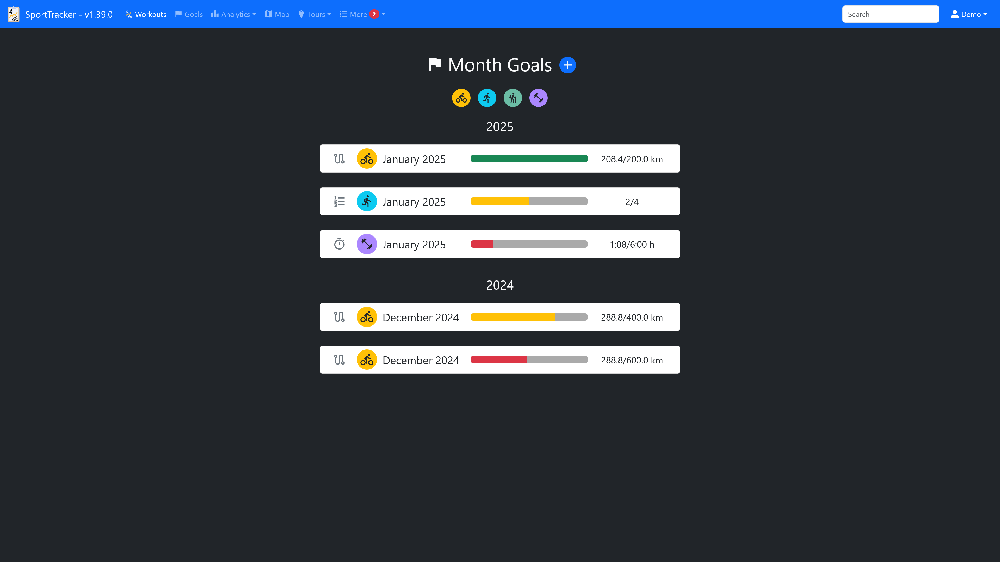
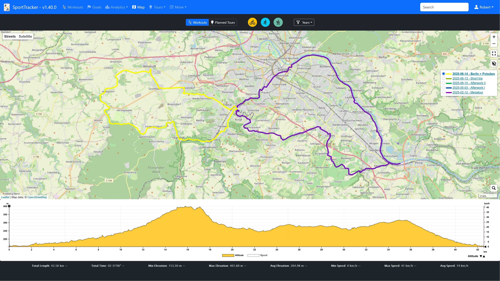
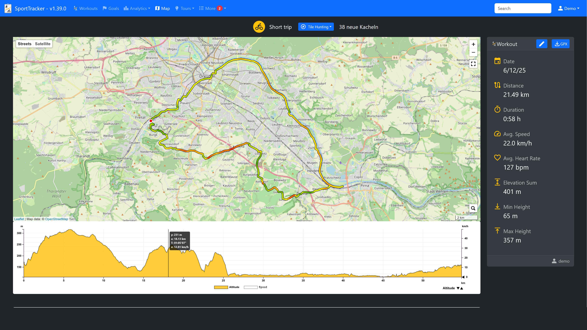
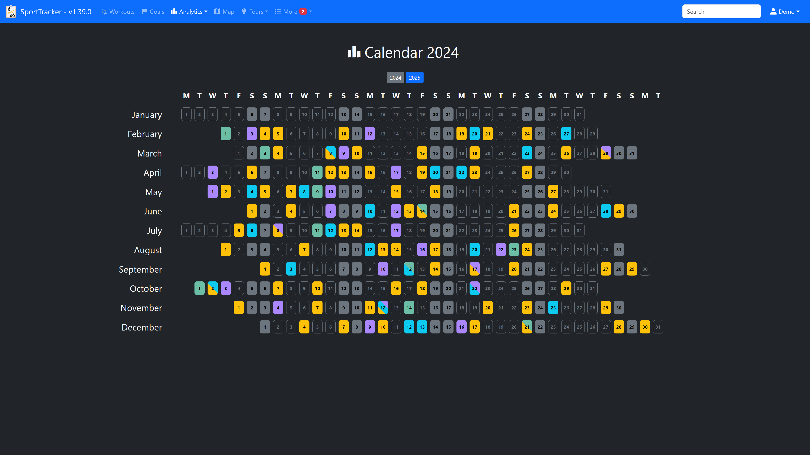
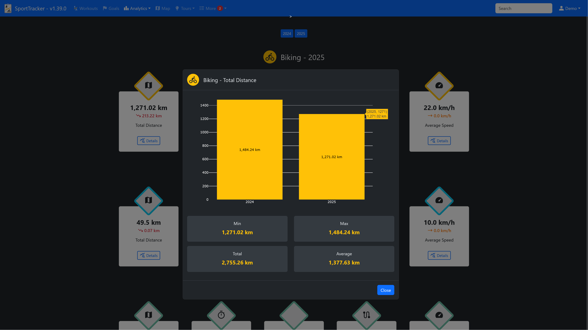
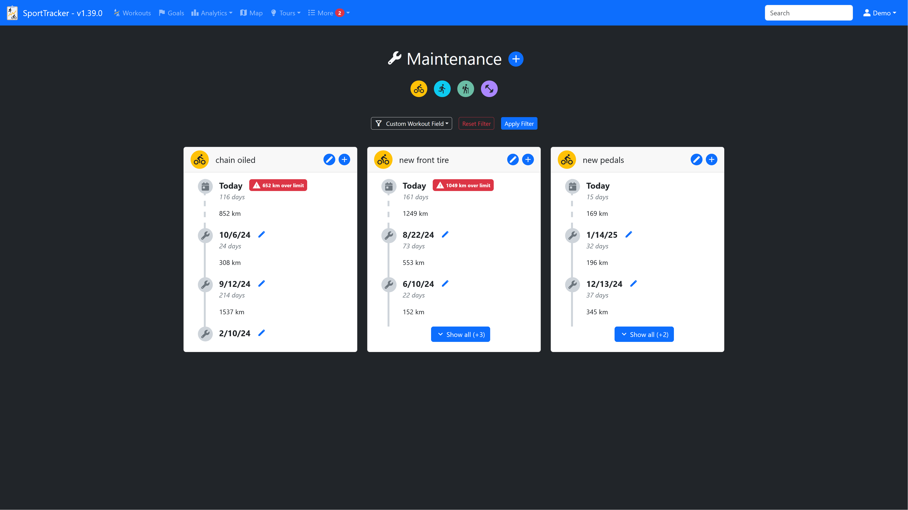
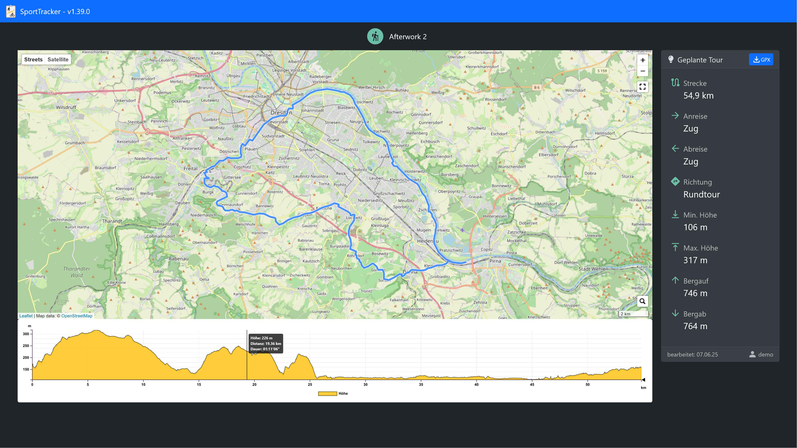

# SportTracker

Self-hosted sport data tracking server.


## Key Features

### Multi-user support
Multiple users can track their sport data using different accounts.

### Record your sport data
Record the data of your training sessions after you have finished them.

Supported types of sports:

Distance-based:
- Biking
- Running
- Hiking

Duration-based:
- Workouts

You can fill in a lot of information for each training session. If the pre-defined inputs are not enough, it is possible to set custom fields for each type of sports.

You can share your tracks via public links.


### Month goals
Set custom month goals (either distance, duration or number of tracks).
The current status of each month goal is visualized via progress bars.



### GPX tracks / Map
A GPX recoding can be attached to every distance-based track. The GPX recordings can be viewed on a map.

View all gpx tracks on a map:


View a single gpx track on a map, with additional information (e.g. track line is colored according to speed):


### FIT tracks
SportTracker also supports .fit files in addition to gpx. Those files will be stored in the `data` folder as well.  
During upload of a .fit file for a track or planned tour, a gpx file is automatically generated from the .fit file.

__NOTE__: The converted gpx file will only contain basic data like latitude, longitude, timestamps and altitude information. 


### Tile Hunting
Each user can optionally enable tile hunting.   
If enabled an additional map is provided that shows all already visited tiles. A tile is considered visited if one or more gpx tracks cross it. By default, the size of a tile is equivalent to the size of an OpenStreetMap tile at zoom level 14 (This can be configured in the SportTracker settings file).
Tile hunting can be useful to discover new areas in your surrounding or gain some motivation to explore new routes.

Overall tile hunting map:


Map for a single track:


#### Tile hunting overlay access
To plan your next tile hunting route you may want to allow access to your tile hunting map via a share code in your user settings.  
This can be useful to add a custom overlay to OpenStreetMap based maps, e.g. https://bikerouter.de.

1. Add a custom overlay layer
2. Use the url shown on your user settings page (e.g. http://localhost/map/tileOverlay/1df60cca70c340239cfd869673443be4/{z}/{x}/{y}.png)

### Charts
Tracked data is visualized in charts, e.g.:
- Distance per month
- Average speed
- Duration per Track
- etc.

Example charts:



### Annual Statistics
Every year is summarized for each sport type.





### Achievements
The achievement page shows aggregated information about all your tracks.


### Maintenance Events
Record your maintenance events for each sport type. You can optionally set reminders for each maintenance.



### Planned Tours
Save your planned tours for each sport type (distance-based types) and view them on a map. Once you actually took a planned tour you can link the corresponding track to the tour.


Share planned tours with other SportTracker users or create public links.


#### Enable GPX review Images

SporTracker can show a preview image for each planned tour. The images are not generated by SportTracker.  
An external service can be used instead.

In order to activate gpx preview images, follow these steps:

**1. Set up a georender instance https://github.com/deadlocker8/georender (forked from https://github.com/loskoderos/georender)**
- a) Build docker image: `docker build -t georender .`
- b) Run docker image with specific settings: `docker run -p 3000:3000 georender -w 800 -h 450 -t osm`

**2. Enable gpx preview images in your SporTracker settings.json
Update the section `gpxPreviewImages` in your settings.json to contain the following values**
```json
"gpxPreviewImages": {
    "enabled": true,
    "geoRenderUrl": "http://localhost:3000"
}
```
Where http://localhost:3000 is the address and port number of your georender instance started in step 1.

### Available languages
- German
- English


## Run SportTracker
1. Install dependencies via `poetry install --no-root --without dev`
2. Copy `settings-example.json` to `settings.json` and adjust to your configuration
3. Run the server: `<path_to_python_executable_in_poetry_venv> src/SportTracker.py` 

💡 Or use the docker image.

## Command line arguments
- `--debug`, `-d` = Enable debug mode
- `--dummy`, `-dummy` = Generate dummy tracks and demo user


## Database migration
Updating to the latest SportTracker release may require database migration.   
This is only necessary if you already have a running SportTracker instance and a database filled with entries.  
Whether a database migration is necessary will be stated in the release notes.  
The migration will be performed automatically upon start of SportTracker.


## This project uses 3rd-party components

### Python dependencies
Python dependencies can be found in `pyproject.toml` and corresponding `poetry.lock`.

### Javascript / CSS dependencies
- Bootstrap https://getbootstrap.com/
- Leaflet https://leafletjs.com/
- Mousetrap https://craig.is/killing/mice
- plotly.js https://github.com/plotly/plotly.js
- jQuery https://jquery.com/

### Additional dependencies
- Google Material Symbols https://fonts.google.com/icons
- Font Awesome Icons https://fontawesome.com/

### Icons / Images
- bike icon by Google Material Icons https://fonts.google.com/icons?selected=Material%20Icons%3Adirections_bike%3A
- runner icon by Google Material Icons https://fonts.google.com/icons?selected=Material%20Icons%3Adirections_run%3A
- checklist icon by Freepik - Flaticon https://www.flaticon.com/de/kostenlose-icons/hakchen